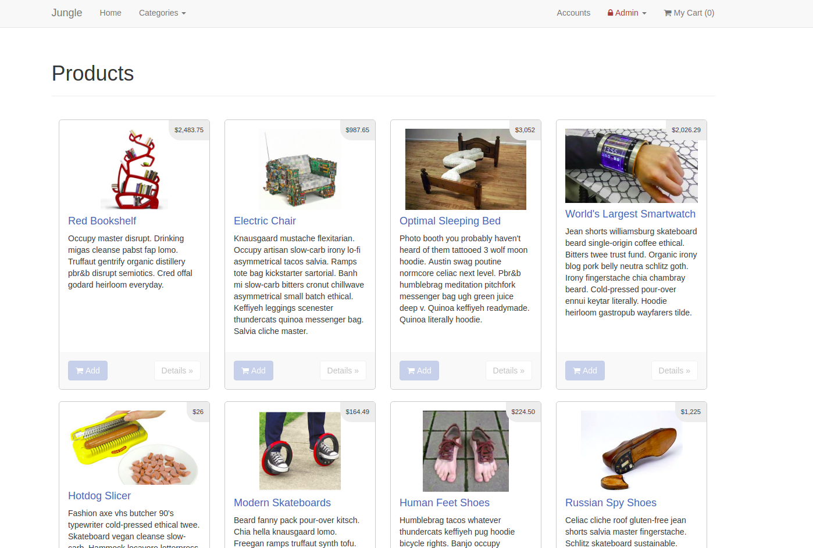
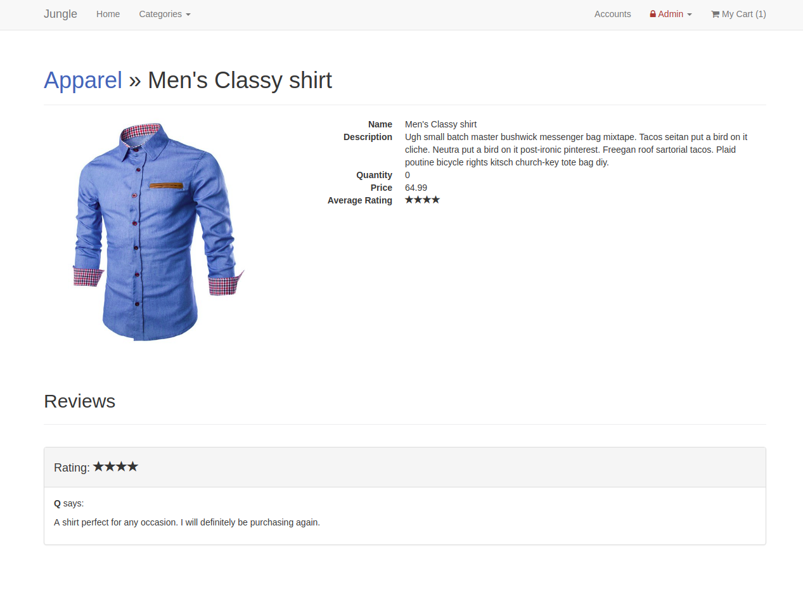
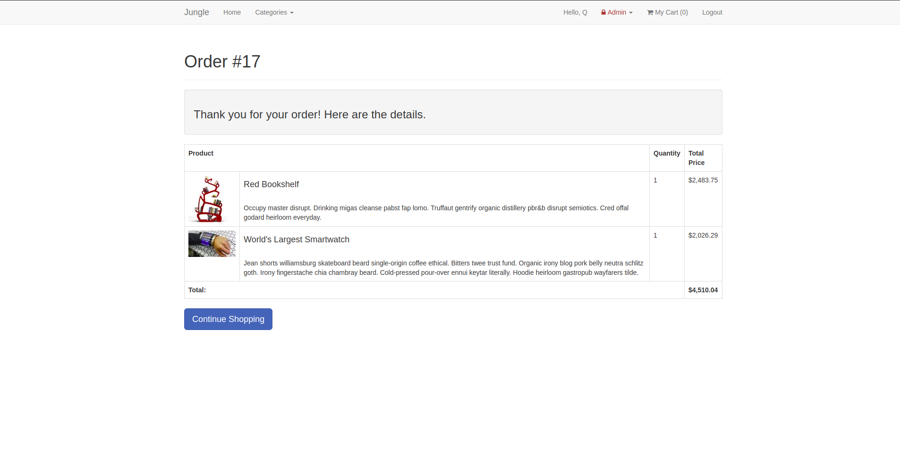

# Jungle

A mini e-commerce application built with Rails 4.2. Used to learn more about Rails and practice contributing to an existing codebase.

The application allows users to create accounts, write reviews, and order items. In addition, Admin users can add new categories and create new products. 

## Screenshots

## Setup

1. Clone the repo
2. Run `bundle install` to install dependencies
3. Create `config/database.yml` by copying `config/database.example.yml`
4. Create `config/secrets.yml` by copying `config/secrets.example.yml`
5. Run `bin/rake db:reset` to create, load and seed db
6. Create .env file based on .env.example
7. Sign up for a Stripe account
8. Add whatever login details you'd like to the .env file for the admin basic HTTP authentication.
9. Put Stripe (test) keys into appropriate .env vars
10. Run `bin/rails s -b 0.0.0.0` to start the server

## Stripe Testing

Use the following Credit Card information for testing success scenarios.

* Number: 4111 1111 1111 1111
* Expiry: any date in the future.
* CVC: Any 3 digit number.

More information in their docs: <https://stripe.com/docs/testing#cards>

## Dependencies

* Rails 4.2
* PostgreSQL 9.x
* Stripe
